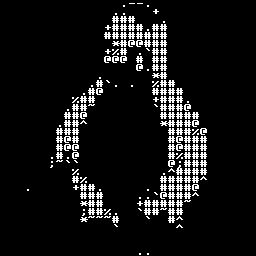

# ASCII-fy
## Description
Converts a JPEG image into an ASCII representation.

## Example

## Requirements
* Java 1.8
* Maven

## Usage
`$ java ImageImporter`

## Demo 
1. Run `$mvn test`.
2. View converted grayscale and ASCII images, along with original at: `/ASCII-fy/target/test-classes`.

## TODO
1. Add a better example in the README.
2. Add arguments parser and allow user to specify input and output file name.
3. Add support for images with alpha channels (e.g. pngs).
4. Refactor ImageImporter. Embed call to toGrayscale() within toASCII().
5. Add more test cases.
6. Explain limitations of program in README.
